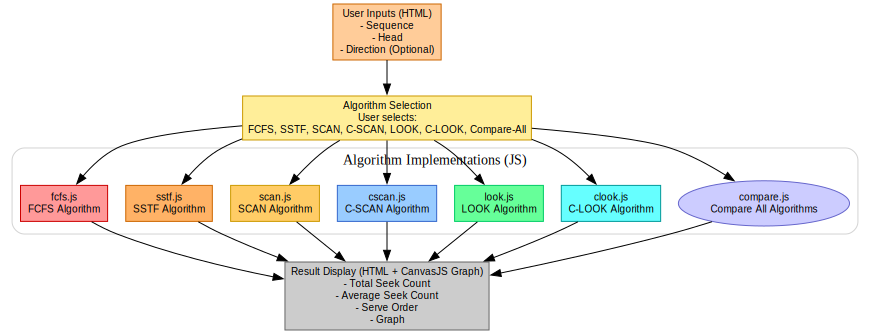

# Disk Scheduling Algorithm Simulator

[](https://disk-scheduler-simulator.netlify.app/)


> EC6110: Operating Systems - Group Assignment 3  
> **Jenarththan Akilan** - 2021/E/006 - 2021e006@eng.jfn.ac.lk  
> **Nathiskar Shriganeshan** - 2021/E/190 - 2021e190@eng.jfn.ac.lk

---

## 📚 Project Description

This project simulates and compares 6 classic disk scheduling algorithms using **HTML**, **CSS**, **JavaScript**, and **CanvasJS** for visualization. It helps to visualize the seek time, order of servicing, and graph for disk scheduling techniques.

---

## ✅ Implemented Algorithms

- First Come First Serve (FCFS)
- Shortest Seek Time First (SSTF)
- SCAN (Elevator Algorithm)
- C-SCAN (Circular SCAN)
- LOOK
- C-LOOK (Circular LOOK)
- Full Algorithm Comparison Module

---

## 🏗️ Architecture



---

## 🎯 Member Responsibilities

### Jenarththan Akilan (2021/E/006)
- Input Validation
- FCFS, C-SCAN, C-LOOK Implementation
- Compare Module

### Nathiskar Shriganeshan (2021/E/190)
- SSTF, SCAN, LOOK Implementation
- CanvasJS Graph Integration
- Compare Module

---

## 🖥️ User Interface

### Inputs:
- Request Queue (comma-separated integers)
- Head Position (integer)
- Direction (Left or Right) for SCAN variants

### Outputs:
- Total Seek Time
- Average Seek Time
- Order of Servicing
- Interactive Graph with Zoom & Crosshair

---

## ✅ Features

- Visualizes disk head movement
- Calculates Total and Average Seek Time
- Supports boundary-based and optimized algorithms
- Compares all algorithms side-by-side
- Shows graph using **CanvasJS**

---

## 🌀 Data Flow

1. User Inputs
2. Algorithm Selection
3. Seek Time Calculation
4. Graph Visualization
5. Best Algorithm Identification (Comparison)

---

## 🛠️ Technology Stack

| Component | Technology |
|-----------|------------|
| Frontend | HTML, CSS, JavaScript |
| Visualization | CanvasJS |
| Algorithms | Pure JavaScript |
| Deployment | Static Website |

---

## 📄 Report & Slides

You can find the official presentation below:

[📥 Disk Scheduling Presentation (PDF)](Images/Disk_Scheduling_Presentation.pdf)

---

## 💻 How to Run

1. Clone this repository:
   ```bash
   git clone <your_repo_link>
   cd <project_folder>
   ```
2. Open `index.html` using any web browser.
3. Input requests, select algorithm, and visualize.

---

## ✔️ Notes
This project was completed as part of **EC6110 - Operating Systems** assignment under the guidance of the Department of Computer Engineering, University of Jaffna.

---
